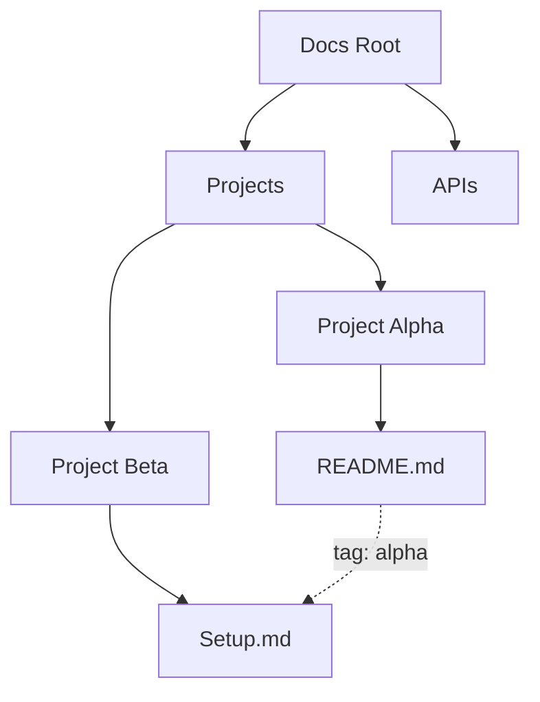

## Overview

Daria Poloz provides powerful tools to streamline your documentation workflow. You create, organize, collaborate, and track changes efficiently in one centralized space. Focus on content while the platform handles structure and teamwork.

<Columns cols={2}>
  <Card title="Rich Editing" icon="edit-3" href="#document-creation">
    Craft documents with markdown, embeds, and visual builders.
  </Card>
  <Card title="Smart Organization" icon="folder" href="#organization">
    Use folders and tags to keep everything accessible.
  </Card>
  <Card title="Team Collaboration" icon="users" href="#collaboration">
    Share, review, and co-edit in real time.
  </Card>
  <Card title="Version History" icon="git-branch" href="#version-control">
    Track changes and revert with confidence.
  </Card>
</Columns>

## Document Creation and Editing Tools

Build professional documentation quickly. You access a full-featured editor supporting markdown, MDX components, and embeds. Switch between visual and code modes seamlessly.

<Tabs>
  <Tab title="Visual Mode" icon="eye">
    Drag-and-drop images, tables, and diagrams. Preview changes live without coding.
  </Tab>
  <Tab title="Code Mode" icon="code">
    Write raw markdown or MDX for advanced layouts.

````mdx
# Welcome

This is a **bold** heading with an embedded image.

<Image src="https://example.com/screenshot.png" alt="Dashboard overview" width="600" height="400" />
````

  </Tab>
</Tabs>

<Callout kind="tip">
  Use `{shortcut: Ctrl+B}` for bold text in visual mode to speed up editing.
</Callout>

## Organization with Folders and Tags

Structure your docs logically. Create nested folders for projects and apply tags for cross-referencing.



<Steps>
  <Step title="Create Folder" icon="folder-plus">
    Click the new folder button in the sidebar.
  </Step>
  <Step title="Add Tags" icon="tag">
    Select a document and enter tags like `api`, `v1.0`.
  </Step>
  <Step title="Search" icon="search">
    Filter by tags or folder paths instantly.
  </Step>
</Steps>

## Collaboration Features for Teams

Invite teammates to co-edit documents in real time. Assign reviewers, add comments, and resolve feedback.

<CodeGroup tabs="Invite,Share">
  ```javascript
  // API to invite user
  await fetch('https://api.example.com/docs/invite', {
    method: 'POST',
    body: JSON.stringify({ email: 'team@company.com', permissions: 'edit' })
  });
  ```
  ```bash
  # CLI share command
  daria share doc-id --email team@company.com --role editor
  ```
</CodeGroup>

Use presence indicators to see who edits live. @-mention users in comments for notifications.

## Version Control and History Tracking

Every change saves automatically. View diffs, restore versions, and branch for experiments.

<Expandable title="View History" default-open="true">
  Right-click a document and select "History". Compare versions side-by-side.

  | Version | Author | Changes | Date |
  |---------|--------|---------|------|
  | v1.2    | You   | Added API section | 2024-10-15 |
  | v1.1    | Alice | Fixed typos | 2024-10-14 |
  | v1.0    | Bob   | Initial draft | 2024-10-10 |
</Expandable>

<Callout kind="success">
  Enable branch previews to test changes without affecting the main doc.
</Callout>

These features make Daria Poloz your go-to for scalable documentation. Start by creating your first folder today.