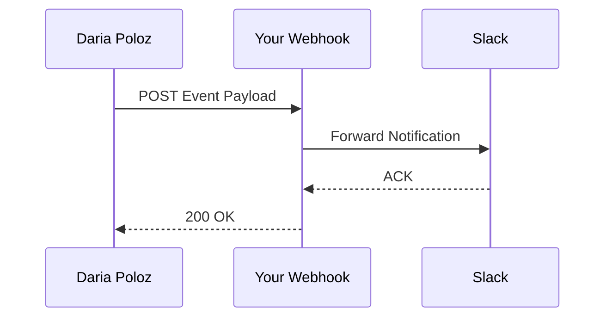

## Overview

Daria Poloz supports seamless integrations with popular third-party services. You can automate notifications, sync content, and extend functionality using webhooks, exports, and the public API. These features help you streamline your documentation workflow without leaving your preferred tools.

<Callout kind="info">
  Review your plan's integration limits in the [dashboard](https://dashboard.example.com/account/billing).
</Callout>

## Supported Integrations

Connect Daria Poloz to essential tools for collaboration and automation.

<Columns cols={3}>
  <Card title="Slack" icon="message-circle" href="https://slack.com" target="_blank">
    Receive real-time notifications for document updates and reviews.
  </Card>
  <Card title="GitHub" icon="github" href="https://github.com" target="_blank">
    Sync documentation with repositories for version control.
  </Card>
  <Card title="Zapier" icon="zap" href="https://zapier.com" target="_blank">
    Build no-code automations with 5000+ apps.
  </Card>
</Columns>

<Columns cols={2}>
  <Card title="Notion" icon="book-open" href="https://notion.so" target="_blank">
    Import and mirror pages between platforms.
  </Card>
  <Card title="Google Workspace" icon="file-text" href="https://workspace.google.com" target="_blank">
    Export docs to Google Docs for team editing.
  </Card>
</Columns>

## Setting Up Webhooks

Webhooks notify external services about events like document publishes or comments. You configure them in your dashboard.

<Steps>
  <Step title="Navigate to Webhooks" icon="settings">
    Go to **Settings > Integrations > Webhooks** in your [dashboard](https://dashboard.example.com).
  </Step>
  <Step title="Create Webhook" icon="plus">
    Click **New Webhook**, enter your endpoint URL (e.g., `https://your-webhook-url.com/daria`), and select events.
  </Step>
  <Step title="Test and Save" icon="check-circle">
    Send a test payload, then save. Monitor deliveries in the webhook logs.
  </Step>
</Steps>

Handle incoming payloads with this example structure:

<CodeGroup tabs="Node.js,Python">
  ```javascript
  app.post('/daria', (req, res) => {
    const event = req.body.event; // e.g., "document.published"
    const docId = req.body.data.id;
    
    if (event === 'document.published') {
      // Notify team
      console.log(`Doc ${docId} published`);
    }
    
    res.status(200).json({ received: true });
  });
  ```
  ```python
  from flask import Flask, request, jsonify
  
  app = Flask(__name__)
  
  @app.route('/daria', methods=['POST'])
  def webhook():
      data = request.json
      event = data['event']  # e.g., "document.published"
      doc_id = data['data']['id']
      
      if event == 'document.published':
          print(f"Doc {doc_id} published")
      
      return jsonify({'received': True})
  ```
</CodeGroup>



## Exporting Documentation

Export your docs to various formats for sharing or archiving.

<Tabs>
  <Tab title="PDF" icon="file">
    Generate print-ready PDFs from the dashboard.
    
    <Steps>
      <Step title="Select Pages">
        Choose docs in **Export > PDF**.
      </Step>
      <Step title="Customize">
        Set theme, margins, and cover page.
      </Step>
      <Step title="Download">
        Click **Export** to get the file.
      </Step>
    </Steps>
  </Tab>
  <Tab title="Markdown" icon="code">
    Export as raw Markdown for GitHub or static sites.
    
    ```
    curl -H "Authorization: Bearer YOUR_API_KEY" \
         https://api.example.com/v1/docs/export/markdown?doc_id=123
    ```
  </Tab>
  <Tab title="HTML" icon="globe">
    Create standalone HTML zips with styles.
    
    Use the API for bulk exports:
    
    <ParamField path="doc_id" param-type="string" required="true">
      Target document ID.
    </ParamField>
    
    <ParamField query="format" param-type="string" required="false">
      Set to `html`. Default: `markdown`.
    </ParamField>
  </Tab>
</Tabs>

## API Access for Custom Extensions

Build custom integrations using the REST API at `https://api.example.com/v1`.

<Callout kind="tip">
  Generate an API key in **Settings > API Keys**. Store it securely.
</Callout>

Authenticate requests:

```
curl -H "Authorization: Bearer YOUR_API_KEY" \
     https://api.example.com/v1/docs
```

<Expandable title="Advanced: Rate Limits" default-open="false">
  The API enforces `{500 requests per minute}` per key. Exceeding limits returns `429 Too Many Requests`.
</Expandable>

<Request tabs="cURL,JavaScript">
  ```bash
  curl -X GET \
    -H "Authorization: Bearer YOUR_API_KEY" \
    https://api.example.com/v1/docs \
    -H "Content-Type: application/json"
  ```
  ```javascript
  const response = await fetch('https://api.example.com/v1/docs', {
    headers: {
      'Authorization': 'Bearer YOUR_API_KEY',
      'Content-Type': 'application/json'
    }
  });
  const docs = await response.json();
  ```
</Request>

<Response tabs="200">
  ```json
  {
    "docs": [
      {
        "id": "doc_123",
        "title": "Getting Started",
        "updated_at": "2024-10-15T10:00:00Z"
      }
    ],
    "meta": {
      "total": 1,
      "limit": 50
    }
  }
  ```
</Response>

These integrations supercharge your Daria Poloz workflow. Start with webhooks for quick wins, then explore the API for deeper customization.